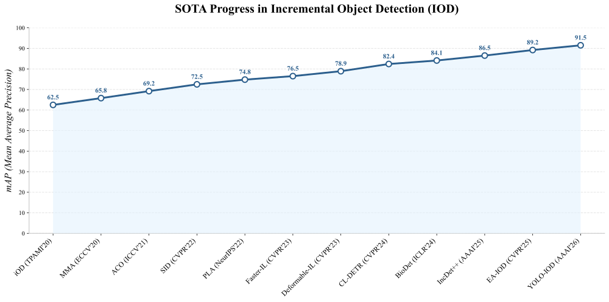

# Awesome Incremental Object Detection 

Incremental Object Detection **(IOD)** enables detectors to continually learn new object categories while preserving previously acquired knowledge—a crucial capability for evolving real-world systems such as autonomous driving and robotics. 

📌 Our goal is to **standardize research practices** and build a unified community hub for IOD.  **We warmly welcome contributions from the community!**

## 🎯 Problem Definition

In IOD, tasks arrive sequentially in an ordered sequence: $\mathcal{T} = \{ \mathcal{T}_1, \mathcal{T}_2, \ldots, \mathcal{T}_t, \ldots, \mathcal{T}_n \}$. Each task $\mathcal{T}_t$ aims to learn a specific set of object categories $\mathcal{C}_t$, and $\quad \mathcal{C}_i \cap \mathcal{C}_j = \emptyset, \; \forall i \ne j$. For each task $\mathcal{T}_t$, a dataset is provided: $\mathcal{D}_t = \{ (\mathcal{X}_t^i, \mathcal{Y}_t^i) \}_{i=1}^{N_t}$, where $\mathcal{X}_t^i$ denotes the $i$-th image and $\mathcal{Y}_t^i$ is its corresponding annotation. Importantly, the dataset $\mathcal{D}_t$ is annotated only for categories in $\mathcal{C}_t$. That is, objects belonging to $\mathcal{C}_{1:t-1} \cup \mathcal{C}_{t+1:n}$ are not annotated, even if presented in the image. During the training of task $\mathcal{T}_t$, only $\mathcal{D}_t$ is accessible. The goal of IOD is to train an object detector $\mathcal{M}_t$ at each stage, such that it can correctly detect objects from both the current task's classes $\mathcal{C}_t$ and all seen classes $\mathcal{C}_{1:t-1}$.

## 🧪 Datasets & bachmark

### 📚 Papers (by year)

#### **🔥 Survey & Tutorials**

| **Year** | **Title**                                                    | **Venue**           | **Link**                                                 |
| -------- | ------------------------------------------------------------ | ------------------- | -------------------------------------------------------- |
| 2023     | Continual Object Detection: A review of definitions, strategies, and challenges | **Neural Networks** | [📄](https://dl.acm.org/doi/10.1016/j.neunet.2023.01.041) |

#### 2026

| **Title**                                                    | **Venue**     | **Code**                                     | **Notes**          |
| ------------------------------------------------------------ | ------------- | -------------------------------------------- | ------------------ |
| YOLO-IOD: Towards Real Time Incremental Object Detection     | **AAAI 2026** | [🔗](https://github.com/qiangzai-lv/YOLO-IOD) | YOLO、Distillation |
| Better Matching, Less Forgetting: A Quality-Guided Matcher for Transformer-based Incremental Object Detection. | **AAAI 2026** |                                              |                    |

#### 2025

| **Title**                                                    | **Venue**                                                    | **Code**                                    | **Notes** |
| ------------------------------------------------------------ | ------------------------------------------------------------ | ------------------------------------------- | --------- |
| Gradient Decomposition and Alignment for Incremental Object Detection | [ICCV 2025](https://openaccess.thecvf.com/content/ICCV2025/html/Luo_Gradient_Decomposition_and_Alignment_for_Incremental_Object_Detection_ICCV_2025_paper.html) | [🔗](https://github.com/FHR-L/GDA-IOD)       |           |
| DuET: Dual Incremental Object Detection via Exemplar-Free Task Arithmetic | [ICCV 2025](https://arxiv.org/abs/2506.21260)                | 🔗                                           |           |
| Dual Domain Control via Active Learning for Remote Sensing Domain Incremental Object Detection | [ICCV 2025](https://openaccess.thecvf.com/content/ICCV2025/papers/Sun_Dual_Domain_Control_via_Active_Learning_for_Remote_Sensing_Domain_ICCV_2025_paper.pdf) | 🔗 | |
| High-dimension Prototype is a Better Incremental Object Detection Learner | [ICLR 2025](https://proceedings.iclr.cc/paper_files/paper/2025/file/7f94f1d0a11e0a0f38f973e5a8925909-Paper-Conference.pdf) | 🔗                                           |           |
| PseDet:Revisiting the Power of Pseudo Label in Incremental Object Detection | [ICLR 2025](https://openreview.net/forum?id=Iu8FVcUmVp)      | [🔗](https://github.com/wang-qiuchen/PseDet) |           |
| Demystifying Catastrophic Forgetting in Two-Stage Incremental Object Detector | [ICML 2025](https://arxiv.org/abs/2502.05540)                | [🔗](https://github.com/fanrena/NSGP-RePRE)  |           |
| iDPA: Instance Decoupled Prompt Attention for Incremental Medical Object Detection | [ICML 2025](https://arxiv.org/abs/2506.00406)                | [🔗](https://github.com/HarveyYi/iDPA)       ||
| Revisiting Generative Replay for Class Incremental Object Detection | [CVPR 2025](https://cvpr.thecvf.com/virtual/2025/poster/34300) | [🔗](https://github.com/qiangzai-lv/RGR-IOD) |           |
| Learning Endogenous Attention for Incremental Object Detection | [CVPR 2025](https://cvpr.thecvf.com/virtual/2025/poster/35014) | [🔗](https://github.com/SONGX1997/LEA)       |           |
| DCA: Dividing and Conquering Amnesia in Incremental Object Detection | [AAAI 2025](https://arxiv.org/abs/2503.15295)                | 🔗                                           |           |
| GCD: Advancing Vision-Language Models for Incremental Object Detection via Global Alignment and Correspondence Distillation | [AAAI 2025](https://ojs.aaai.org/index.php/AAAI/article/download/32864/35019) | [🔗](ttps://github.com/Never-wx/GCD)         |           |
| Diffuse&Refine: Intrinsic Knowledge Generation and Aggregation for Incremental Object Detection | [IJCAI 2025](https://www.ijcai.org/proceedings/2025/700) | [🔗]()         |           |

类似检测的mae 可以找个与测试setting无关的数据集 预训练一个 显著性检测的

重建模块

